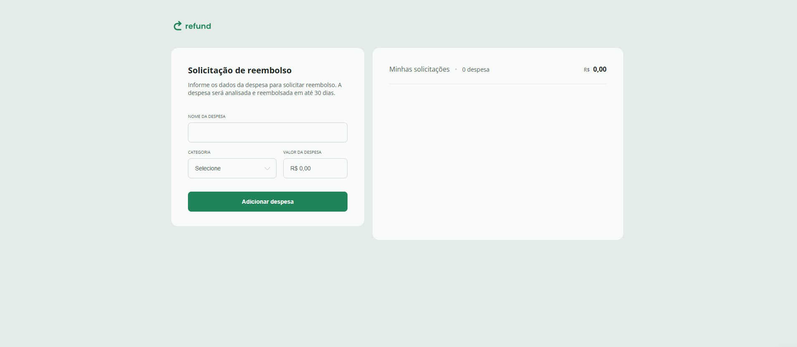
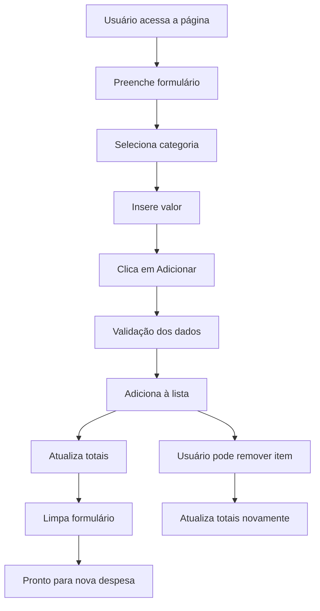

# Refund - Sistema de Solicitação de Reembolso


*Captura de tela da interface principal do sistema Refund*

## 📋 Descrição

O **Refund** é uma aplicação web para gerenciamento de solicitações de reembolso de despesas. O sistema permite aos usuários cadastrar despesas por categoria, visualizar o total acumulado e gerenciar suas solicitações de forma intuitiva.

## 🚀 Funcionalidades

### ✅ Principais Recursos
- **Cadastro de Despesas**: Adicione despesas com nome, categoria e valor
- **Categorização**: Organize despesas por tipo (Alimentação, Hospedagem, Serviços, Transporte, Outros)
- **Formatação Automática**: Valores são automaticamente formatados em Real Brasileiro (BRL)
- **Cálculo Automático**: Total das despesas calculado em tempo real
- **Remoção de Itens**: Exclua despesas individualmente
- **Interface Responsiva**: Adaptável para desktop, tablet e mobile
- **Validação de Formulário**: Campos obrigatórios com validação

### 📊 Categorias Disponíveis
- 🍽️ **Alimentação** - Despesas com refeições e alimentação
- 🏨 **Hospedagem** - Gastos com acomodação e estadia
- 🔧 **Serviços** - Despesas com serviços diversos
- 🚗 **Transporte** - Custos de deslocamento e transporte
- 📦 **Outros** - Demais tipos de despesas

## 🛠️ Tecnologias Utilizadas

- **HTML5** - Estrutura semântica da aplicação
- **CSS3** - Estilização e layout responsivo
- **JavaScript (Vanilla)** - Lógica de negócio e interatividade
- **SVG** - Ícones vetoriais para categorias e interface
- **Google Fonts** - Tipografia (Open Sans)

## 📁 Estrutura do Projeto

```
Refund/
├── img/                    # Recursos visuais
│   ├── accommodation.svg   # Ícone de hospedagem
│   ├── chevron-down.svg   # Ícone de dropdown
│   ├── food.svg           # Ícone de alimentação
│   ├── logo.svg           # Logo da aplicação
│   ├── others.svg         # Ícone para outros
│   ├── remove.svg         # Ícone de remoção
│   ├── screenshot.png     # Captura de tela da aplicação
│   ├── services.svg       # Ícone de serviços
│   └── transport.svg      # Ícone de transporte
├── index.html             # Página principal
├── script.js              # Lógica JavaScript
├── styles.css             # Estilos CSS
└── README.md              # Documentação
```

## 🎨 Design e Interface

### Paleta de Cores
- **Verde Principal**: `#1f8459` - Botões e elementos ativos
- **Verde Claro**: `#2cb178` - Hover states
- **Fundo**: `#e4ece9` - Cor de fundo da aplicação
- **Cards**: `#f9fbfa` - Fundo dos formulários e listas
- **Texto Principal**: `#1f2523` - Cor do texto principal
- **Texto Secundário**: `#4d5c57` - Legendas e textos auxiliares
- **Bordas**: `#cdd5d2` - Bordas de inputs e divisores

### Responsividade
- **Desktop**: Layout em duas colunas (formulário + lista)
- **Tablet** (< 1100px): Layout adaptado com fonte menor
- **Mobile** (< 620px): Layout em coluna única, elementos empilhados

## 💻 Como Usar

### Instalação
1. Clone ou baixe o projeto
2. Abra o arquivo `index.html` em um navegador web
3. Não há dependências externas - funciona offline

### 📸 Adicionando Screenshot
Para adicionar uma captura de tela da aplicação:
1. Abra a aplicação no navegador
2. Capture uma screenshot da tela inicial
3. Salve como `screenshot.png` na pasta `img/`
4. A imagem será exibida automaticamente no README

### Adicionando uma Despesa
1. Preencha o **nome da despesa**
2. Selecione a **categoria** apropriada
3. Digite o **valor** (formatação automática em R$)
4. Clique em **"Adicionar despesa"**

### Gerenciando Despesas
- **Visualizar**: Todas as despesas aparecem na lista lateral
- **Total**: Valor total é calculado automaticamente
- **Remover**: Clique no ícone de lixeira para excluir uma despesa
- **Contador**: Número de despesas é atualizado em tempo real

## 🔧 Funcionalidades Técnicas

### Formatação de Moeda
- Entrada automática formatada em Real Brasileiro
- Conversão de centavos para reais
- Validação numérica com regex

### Validação de Formulário
- Campos obrigatórios marcados com `required`
- Validação de categoria selecionada
- Prevenção de envio com dados inválidos

### Gerenciamento de Estado
- Lista de despesas mantida no DOM
- Cálculos em tempo real
- Limpeza automática do formulário após adição

### Tratamento de Erros
- Try/catch para operações críticas
- Alertas informativos para o usuário
- Logs de erro no console para debug

## 🎯 Casos de Uso

### Cenário Típico
1. **Funcionário** registra despesas de viagem de negócios
2. **Categoriza** cada gasto (hotel, alimentação, transporte)
3. **Visualiza** o total para conferência
4. **Remove** itens incorretos se necessário
5. **Submete** solicitação para reembolso

### Benefícios
- ✅ Organização clara das despesas
- ✅ Cálculo automático de totais
- ✅ Interface intuitiva e responsiva
- ✅ Validação de dados em tempo real
- ✅ Experiência de usuário otimizada

## 🔄 Fluxo da Aplicação



## 📱 Compatibilidade

- ✅ Chrome 60+
- ✅ Firefox 55+
- ✅ Safari 12+
- ✅ Edge 79+
- ✅ Dispositivos móveis (iOS/Android)

## 🚀 Possíveis Melhorias Futuras

- 💾 **Persistência de dados** (LocalStorage/IndexedDB)
- 📤 **Export para PDF/Excel**
- 🔐 **Sistema de autenticação**
- 📊 **Relatórios e gráficos**
- 🌐 **Integração com APIs de backend**
- 📷 **Upload de comprovantes**
- 🔔 **Notificações de status**
- 📅 **Filtros por data**

## 📄 Licença

Este projeto é de uso livre para fins educacionais e demonstrativos.

---

**Desenvolvido com ❤️ para facilitar o gerenciamento de reembolsos**